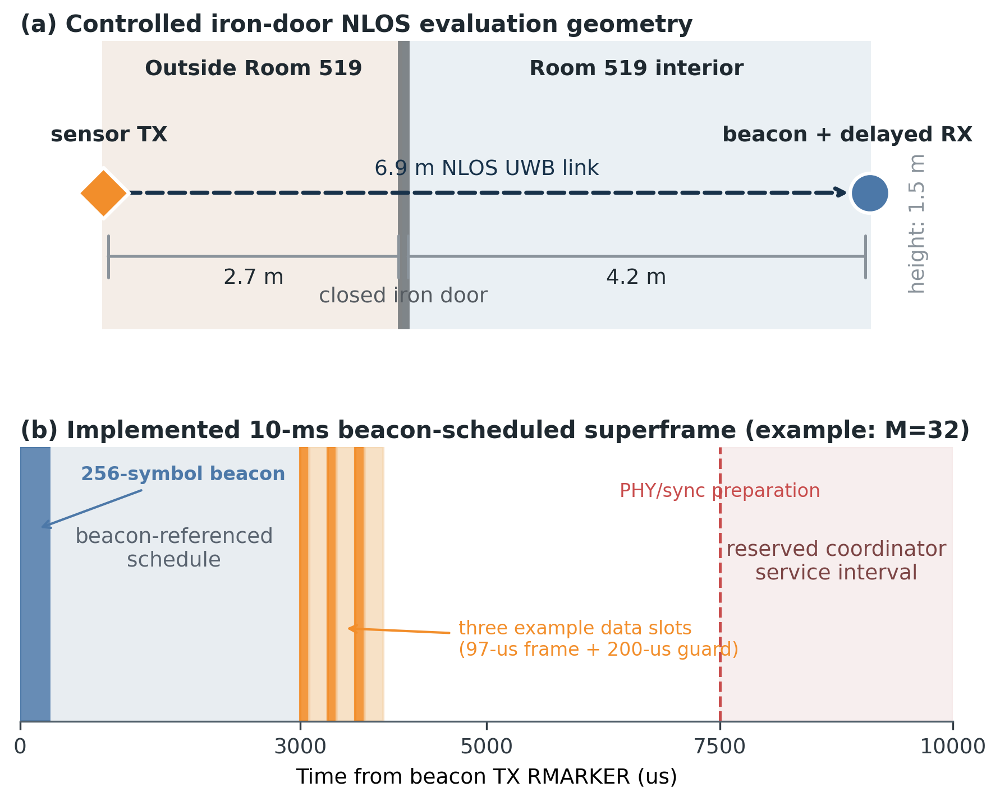
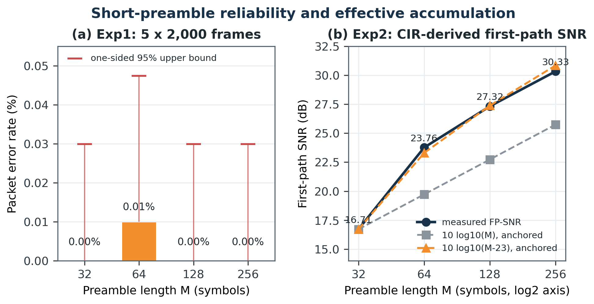
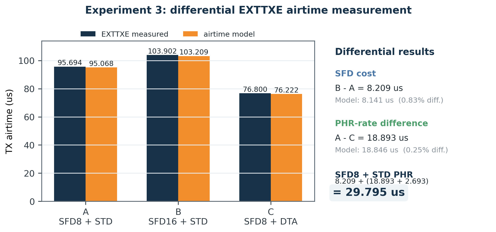
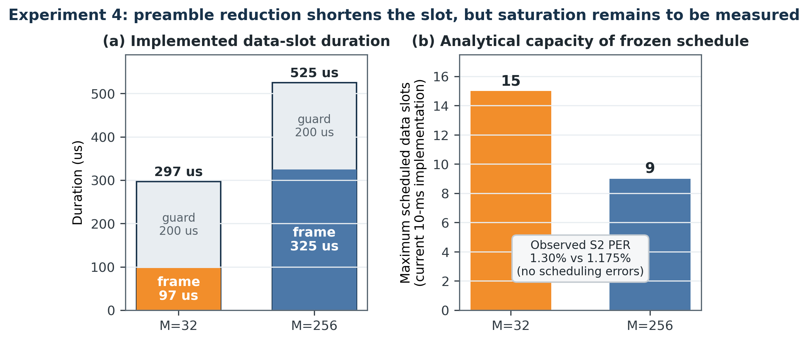

# Beacon-Referenced Short-Preamble HRP-UWB TDMA for Small Sensor Reports: A DWM3000 Study Toward Reduced-SHR Subslots

**Anonymous Authors**  
**Working manuscript for IEEE Internet of Things Journal — Draft v0.1, 13 August 2026**

**Abstract—** High-rate pulse repetition frequency ultra-wideband (HRP-UWB) is widely deployed for secure ranging, yet the same radios can also carry periodic sensor reports. For short reports, however, the synchronization header and physical header occupy a substantial fraction of every transmission. This paper studies beacon-referenced reduced-SHR subslots (BRRS), in which a coordinator broadcasts a common schedule and sensor nodes transmit in deterministic slots with shortened synchronization overhead. Because the commercial DWM3000 does not expose a mode that removes preamble detection, the start-of-frame delimiter (SFD), or the physical header (PHR), we implement a standard-compatible prototype that retains SFD and PHR while reducing the data preamble from 256 to 32 symbols and using beacon-scheduled delayed transmission and reception. In a 6.9-m iron-door non-line-of-sight link, a 32-symbol data preamble incurred no packet loss in 10,000 transmissions with a 15-us receiver lead margin. Circuit diagnostic data showed an effective accumulation count of M-23 symbols and first-path SNR growth consistent, within 0.51 dB after anchoring, with a 10 log10(M-23) trend. Differential EXTTXE airtime measurements estimated the retained 8-symbol SFD plus standard-rate PHR overhead as 29.795 us. With a 200-us implementation guard, shortening the preamble reduced the measured frame airtime from 325 to 97 us and the slot from 525 to 297 us, increasing the current 10-ms schedule capacity from 9 to 15 slots. Two-node trials showed 1.30% and 1.175% pooled packet error rates for 32- and 256-symbol data frames, respectively, without slot or superframe violations. These results establish the feasibility and timing budget of short-preamble scheduled UWB; saturation-scale network and in-vehicle channel experiments remain necessary before claiming the full ideal-BRRS capacity.

**Index Terms—** Ultra-wideband, IEEE 802.15.4z, DWM3000, sensor networks, TDMA, preamble, delayed reception, channel utilization.

> **WORKING-DRAFT STATUS.** The evidence in this version is intentionally separated into measured results and planned validation. Stage 0 was collected before the final test-area cleanup and will be repeated. Experiment 4 currently covers one and two transmitting nodes; higher slot counts and saturation tests are pending. The vehicle channel study originally listed as Experiment 5 in the 0330 concept document is also pending. Final submission data will be collected under one frozen firmware revision with raw logs and manifests.

## I. Introduction

HRP-UWB radios are primarily associated with time-of-flight ranging, secure access, and localization. The underlying IEEE 802.15.4 UWB physical layer nevertheless supports packet data, creating an opportunity to reuse an installed UWB radio for small periodic sensor reports. This opportunity is relevant to systems that already require UWB timing or ranging infrastructure, including vehicle-body networks, robotic platforms, and distributed industrial sensors. In such systems, reusing UWB may avoid a second radio and can provide spectrum diversity relative to 2.4-GHz Bluetooth Low Energy (BLE) and Wi-Fi. The motivation is not that UWB universally replaces BLE: a dedicated BLE link may be more airtime-efficient for small payloads. Rather, this work asks whether the fixed overhead of an already-present UWB link can be reduced enough to make scheduled telemetry practical.

The obstacle is the ratio between fixed physical-layer overhead and useful data. An HRP-UWB frame comprises a synchronization header (SHR), containing the preamble and SFD, followed by the PHR and physical-layer service data unit (PSDU). For a short sensor report, the preamble duration can exceed the useful payload duration by several times. Increasing the PSDU data rate alone does not remove this fixed cost. This issue is particularly visible in deterministic uplinks where each node sends one short report in its own slot: every report pays a new preamble, SFD, and PHR.

The 0330 concept document proposed BRRS, a beacon-referenced subslot structure that removes redundant acquisition overhead after a common beacon. Its ideal form assumes that the receiver can avoid blind preamble search, infer the data boundary from the announced schedule, omit SFD and PHR, and retain only the preamble symbols needed for fine synchronization and channel estimation. That ideal receiver is not available through the DWM3000 application programming interface. The present study therefore treats BRRS as a design target and evaluates its components with a standard-compatible prototype. The data frames still contain a preamble, SFD, and PHR; the beacon instead supplies the preamble length, PSDU length, data rate, participating-node bitmap, slot ownership, first-slot offset, slot interval, and superframe period. The coordinator opens its receiver around the scheduled arrival and the sensors use delayed transmission.

This distinction is central to the paper's claim. A 256-to-32-symbol change is an eightfold reduction in the preamble symbol count, but it is not an eightfold reduction in the complete slot. In the current implementation, a 200-us guard and retained SFD/PHR reduce the slot from 525 to 297 us, corresponding to a 43.4% reduction and a calculated capacity change from 9 to 15 data slots in a 10-ms superframe. The full BRRS gain is therefore an analytical projection that uses measured component costs, not a capability already demonstrated by the commercial receiver.

The contributions of this working manuscript are as follows.

- We formulate a beacon-referenced short-report TDMA design and define a precise boundary between an ideal reduced-SHR receiver and the DWM3000-compatible implementation.
- We show that delayed reception requires an explicit receiver lead margin and present preliminary diagnostic evidence that receiver acquisition consumes an approximately fixed number of preamble symbols under the tested configuration.
- We measure packet error rate and CIR-derived first-path SNR for 32–256-symbol preambles in a controlled 6.9-m iron-door NLOS link.
- We replace the original software timestamp method of the 0330 plan with hardware EXTTXE pulse capture and differential SFD/PHR measurements that cancel fixed pipeline delay.
- We implement a concrete beacon protocol and multi-slot superframe, then quantify the measured frame duration, implemented slot duration, scheduling correctness, and currently available slot capacity.

The remainder of this paper proceeds from the fixed-overhead problem to the proposed design, implementation, results, and the experiments still required for a defensible journal submission.

## II. Background, Related Work, and Problem Definition

### A. HRP-UWB frame overhead

Let M be the number of data-preamble symbols and L be the PSDU length in bytes. The standard-compatible frame airtime is represented as

$$T_frame(M,L) = M T_psym + T_SFD + T_PHR + T_PSDU(L,C_RS),$$

where T_psym is the preamble-symbol duration and C_RS denotes the Reed–Solomon coding overhead applied at physical-layer block boundaries. The implemented slot is

$$T_slot^impl(M,L) = ceil_us(T_frame(M,L)) + T_guard^impl.$$

The useful application payload in this prototype is 16 bytes. The on-air PSDU is 26 bytes: an 8-byte BRRS protocol header, the 16-byte application payload, and a 2-byte IEEE 802.15.4 frame check sequence. Consequently, increasing the PSDU rate or shrinking the application report does not remove the preamble, SFD, PHR, protocol-header, and guard costs.

The 0330 analysis used simplified field durations and a 5–10-us ideal guard to expose the fundamental overhead. The present implementation instead uses the coded DWM3000 airtime model and a measured service budget. The model predicts 97 and 325 us for 32- and 256-symbol frames, respectively, and Experiment 4 reserves a 200-us guard between scheduled arrivals.

### B. Receiver acquisition and delayed reception

The DWM3000 receiver performs preamble correlation, timing acquisition, SFD detection, header decoding, and payload decoding. Scheduled delayed reception narrows the interval in which the radio must listen, but it does not disable these acquisition functions. A delayed-RX command also does not mean that the analog and digital receive chain becomes useful instantaneously at the commanded timestamp. The receive window must be opened before the expected preamble/SFD boundary by the preamble duration plus an implementation lead margin.

We define the data receiver opening interval as

$$T_early = T_preamble + T_SFD + T_lead,$$

$$T_window = T_early + T_PHR+PSDU + T_tail.$$

Here, T_lead compensates receiver startup, discrete PAC alignment, clock and scheduling quantization, and unmodeled implementation delay. T_tail only extends the time available after the scheduled boundary. If the receiver misses enough early preamble symbols, a longer tail cannot restore those symbols. This explains why a lead-only margin can improve reception more strongly than a tail-only margin.

The current packet acquisition chunk is PAC8. Prior evaluations of IEEE 802.15.4z hardware have shown that PAC and other PHY settings influence receiver sensitivity [5]. PARIS also changes the receiver activation time in an in-vehicle polling network, but its objective is to suppress overlapping interference and prioritize frames [6]. Our focus is different: we use the beacon reference to quantify how short the per-sensor preamble can be and how that reduction changes the scheduled data capacity. Accordingly, a lead-margin sweep alone is not presented as the novelty; the contribution is the integration of acquisition diagnostics, field-overhead measurement, and a multi-slot short-report schedule.

### C. Problem statement

Consider one coordinator and N sensors. At the start of each 10-ms superframe, the coordinator transmits a beacon. Each active sensor transmits one 16-byte report in an assigned data slot. There are no acknowledgments or retransmissions in the measured data path. The design objectives are:

1. minimize the data-slot airtime while meeting a target packet error rate;
2. retain deterministic slot identity and superframe identity without carrying a redundant slot offset in every data frame;
3. distinguish physical link loss from scheduler failure; and
4. quantify what fraction of the ideal BRRS saving can be realized on an unmodified DWM3000 PHY.

We therefore evaluate four questions. First, what preamble length remains reliable under a fixed delayed-RX lead? Second, how does first-path SNR change with preamble length? Third, what are the SFD and PHR airtime costs that an ideal BRRS receiver would remove? Fourth, how many standard-compatible short-preamble data slots fit in the implemented superframe, and can multiple nodes use those slots without schedule violations?

## III. BRRS Design and DWM3000-Compatible Realization

### A. Ideal BRRS versus the implemented prototype

Table I separates the original design target from the present evidence. The ideal BRRS frame uses a mini-preamble followed directly by a known-length data block. The DWM3000 prototype must retain a supported preamble, SFD, and PHR. Experiments 1 and 2 directly test the shortened preamble. Experiment 3 measures the retained delimiter and header cost so that it can be subtracted analytically. Experiment 4 measures the complete standard-compatible schedule.

**TABLE I. Ideal BRRS and DWM3000-compatible claim boundary**

| Component | Ideal BRRS target | DWM3000 prototype | Evidence in this draft |
|---|---|---|---|
| Beacon | Announces schedule and PHY profile | 256-symbol beacon, protocol v3 | Implemented |
| Data preamble | Mini-preamble, initially 16–32 symbols | Supported 32–256 symbols | Exp1, Exp2 |
| Blind preamble search | Avoided by reference timing | Acquisition engine still active | Stage 0 diagnostics |
| SFD | Omitted | Retained, 8 or 16 symbols | Exp3 differential measurement |
| PHR | Omitted because length/rate are announced | Retained, STD or DTA rate | Exp3 differential measurement |
| Guard | Analytical 5–10 us | 200 us in current multi-node implementation | Exp4 |
| Network scale | 4–8 physical nodes in 0330 plan | 1–2 physical nodes measured | Exp4; expansion pending |

This boundary avoids a misleading equivalence between a standard 32-symbol preamble and a receiver that has eliminated preamble detection. The prototype is evidence toward BRRS, not a complete nonstandard PHY implementation.

### B. Beacon protocol and slot identity

The protocol-v3 beacon has a 39-byte PSDU and contains a common source, destination, message type, protocol version, and 16-bit superframe sequence. Its schedule fields are the data preamble length, data PSDU length, data rate, active-node bitmap, first-slot RMARKER offset, slot interval, superframe period, slot count, and a packed list of slot owners. Up to 32 data slots can be announced. A seven-bit active bitmap represents sensor identities N2–N8; the explicit owner list also permits repeated or noncontiguous assignments.

Data frames contain the same common 8-byte header and 16-bit superframe sequence but do not repeat the slot offset. The coordinator determines slot identity from the physical receive RMARKER and the beacon schedule, choosing the nearest scheduled RMARKER. It rejects wrong-length, wrong-superframe, wrong-slot, and invalid-configuration frames separately. Thus, the beacon—not the data payload—defines who transmits and when.

### C. Superframe timing

Figure 1 shows the present NLOS geometry and implemented timing. The coordinator beacon uses a 256-symbol preamble. The first data RMARKER is scheduled 3000 us after the beacon TX RMARKER. For Experiment 4, the coordinator reserves the final 2500 us of the 10-ms superframe for data-to-beacon PHY reconfiguration and delayed-beacon arming. Data slots therefore occupy a 4500-us budget from 3000 to 7500 us.

For a slot interval T_slot and decoded-data duration T_DP, the current static capacity check is

$$N_max = 1 + floor((T_budget - T_DP - T_guard) / T_slot),$$

bounded by the 32-slot beacon format. This is an implementation capacity, not the ideal BRRS utilization formula. It includes the measured guard and reserves coordinator service time.

### D. Receiver timing calibration

Stage 0 sweeps T_lead while holding M=32 and T_tail=0. The preliminary results indicate a sharp transition: leads of 0–12 us failed almost entirely, lead 13 us produced acquisition diagnostics but no complete frames, and 14–15 us crossed into a low-PER regime. At lead 13 us, failed frames were dominated by PHR errors after a diagnostic accumulation count of six, whereas successful lead-15 frames had an accumulation count of nine. At larger leads, the observed accumulation count changes in PAC-related steps rather than monotonically.

This behavior supports a practical calibration rule—choose the smallest lead that yields a stable, high accumulation mode and meets the PER target, then add a small robustness margin—but does not yet establish a universal constant. Stage 0 was run before the final removal of a chair from the controlled area and must be repeated. The lead of 15 us is therefore frozen for the current Exp1–Exp4 dataset but is labeled provisional.

## IV. Implementation and Experimental Method

### A. Hardware and PHY configuration

The testbed uses DWM3000 modules controlled by nRF52840 development boards. The data PHY uses UWB channel 9, preamble code 9, 64-MHz pulse repetition frequency, PAC8, STS disabled, and a 6.81-Mb/s payload rate. Unless an Experiment 3 variant changes it, the SFD is the 8-symbol setting and the PHR uses the standard rate. The beacon preamble is fixed at 256 symbols. Data preambles are M in {32, 64, 128, 256}. The coordinator uses delayed RX for the first scheduled arrival and double-buffer-aware burst reception for subsequent multi-node slots; sensors use delayed TX and schedule their next beacon reception from the advertised superframe.

The application payload is 16 bytes and the PSDU is 26 bytes. No ACK and no data retransmission are enabled. This point matters for interpretation: the reported PER is the fraction of originally scheduled frames not decoded correctly, not a post-retransmission delivery metric.

### B. Environment

The current submission-oriented block uses a 6.9-m NLOS geometry separated by a closed iron door. The sensor is 2.7 m outside the door reference plane and the coordinator is 4.2 m inside Room 519. Both antennas are approximately 1.5 m above the floor. The nodes remain fixed within a block and the preamble order is varied across runs. The final protocol will record door state, antenna orientation, nearby objects, temperature, firmware hash, board identity, run order, and operator interventions.

### C. Metrics and collection integrity

PER is reported as 100(N_expected-N_rx)/N_expected. For zero observed errors, we also report a one-sided 95% exact upper bound, because zero observed errors does not imply a zero underlying error probability. Scheduler correctness is evaluated independently through wrong-slot, wrong-superframe, delayed-schedule-late, configuration-error, and collection-status counters.

Experiment 2 reads DWM3000 CIR memory after each successfully decoded frame. The first-path SNR ratio is computed from peak power around the first-path index and a pre-arrival noise floor. The firmware's dwt_calculate_rssi output is invalid (-128 dBm) in some short-preamble runs, so this paper does not use that value. CIR statistics are conditional on successful reception; lost frames have no valid CIR sample, producing survivor bias when PER is nonzero.

All automatic captures require a READY marker, an experiment-specific completion marker, and internally consistent counts. Metadata files record the binary SHA-256, raw-log SHA-256, role, environment, distance, and collection method. The current draft still includes legacy PDF-only Exp1 and Exp4-S2 records; final submission will replace these with raw logs from a single frozen firmware package.

### D. Experiment matrix

**TABLE II. Current and planned experimental evidence**

| Stage | Variable | Current repetitions | Primary output | Draft status |
|---|---|---:|---|---|
| Stage 0 | lead 0–40 us, M=32 | 1–2 x 2000 | PER, failure class, accumCount | Preliminary; repeat after cleanup |
| Exp1 | M=32,64,128,256 | 5 x 2000 | PER, accumCount | Current strongest link result |
| Exp2 | M=32,64,128,256 | 2 x 1000 | CIR first-path SNR | Complete for one environment |
| Exp3 | A=SFD8/STD, B=SFD16/STD, C=SFD8/DTA | 2 x 1000 | EXTTXE airtime | C run 1 has 999 captures; repeat |
| Exp4 | M=32,256; S=1,2; guard=200 us | 2 x 1000 superframes | slot timing, PER, goodput | Scale and saturation pending |
| Exp5 | vehicle positions and channel metrics | 0 | delay spread, K-factor, path loss | Planned |

## V. Results

### A. Exp1: short-preamble packet reception

With T_lead=15 us and T_tail=0, the 32-symbol data preamble delivered all 10,000 scheduled frames across five runs. The 64-symbol configuration lost one of 10,000 frames; 128 and 256 symbols again had no observed loss. The pooled PER over all four configurations was 0.0025% (one loss in 40,000 frames). For each zero-loss 10,000-frame condition, the one-sided 95% exact upper bound on the underlying PER is approximately 0.030%.

**TABLE III. Experiment 1 packet reception and accumulation results**

| M (symbols) | Received / expected | Observed PER | Dominant accumCount | One-sided 95% PER upper bound |
|---:|---:|---:|---:|---:|
| 32 | 10000 / 10000 | 0.000% | 9 | 0.030% |
| 64 | 9999 / 10000 | 0.010% | 41 | 0.047% |
| 128 | 10000 / 10000 | 0.000% | 105 | 0.030% |
| 256 | 10000 / 10000 | 0.000% | 233 | 0.030% |

The successful-frame diagnostic modes follow accumCount=M-23 exactly. This suggests that, under the frozen timing and PAC8 setting, approximately 23 preamble symbols are consumed before the DWM3000's reported coherent accumulation interval. It does not mean that the first 23 physical symbols are universally discarded, nor does it prove a manufacturer-independent algorithm. It is an empirical device/configuration invariant to be challenged in other environments and with PAC4.

Figure 2(a) emphasizes that the four PER values are statistically indistinguishable at the current sample size. The correct interpretation is therefore not that 32 symbols is better than 256, but that no reliability penalty was resolved in this particular controlled NLOS block once the receiver lead was calibrated.

### B. Exp2: CIR quality versus preamble length

The CIR-derived first-path SNR increased from 16.71 dB at M=32 to 30.33 dB at M=256. Relative to M=32, the measured gains were 7.05, 10.61, and 13.62 dB at 64, 128, and 256 symbols. A full-length 10log10(M) trend predicts only 3.01, 6.02, and 9.03 dB. In contrast, anchoring a 10log10(M-23) trend at M=32 predicts 6.58, 10.67, and 14.13 dB; its maximum absolute residual is 0.51 dB.

**TABLE IV. Experiment 2 CIR-derived first-path SNR**

| M | Valid CIR samples | Mean FP-SNR | Gain from M=32 | Anchored 10log10(M-23) |
|---:|---:|---:|---:|---:|
| 32 | 1998 | 16.71 dB | 0.00 dB | 0.00 dB |
| 64 | 2000 | 23.76 dB | 7.05 dB | 6.58 dB |
| 128 | 1999 | 27.32 dB | 10.61 dB | 10.67 dB |
| 256 | 2000 | 30.33 dB | 13.62 dB | 14.13 dB |

This result refines the processing-gain statement in the 0330 document. The absolute theoretical coding gain 10log10(127M) should not be equated to the measured first-path SNR. What the current experiment supports is the slope after accounting for an apparent acquisition budget. Cross-environment replication is required before M-23 can be presented as a general model.

### C. Exp3: SFD and PHR overhead by differential airtime

The original 0330 procedure proposed using RMARKER and a software-observed receive-complete event. That method cannot yield an absolute SHR or data-field duration because RMARKER is located at the SFD boundary and the receive-complete flag includes unknown pipeline and polling delay. The implemented experiment instead routes the DWM3000 EXTTXE signal to an nRF52840 input and captures both pulse edges with GPIOTE/PPI and a 16-MHz timer. The resulting duration is hardware-captured TX airtime with 62.5-ns timer resolution and no CPU intervention between edges.

Three variants isolate field costs. A uses SFD8 and standard-rate PHR; B changes only SFD8 to SFD16; C returns to SFD8 and changes only the PHR to the faster DTA rate. The mean of two runs was 95.694, 103.902, and 76.801 us for A, B, and C, respectively.

The measured B-A difference is 8.209 us, compared with the 8.141-us analytical duration of eight extra SFD symbols (0.83% difference). The A-C difference is 18.893 us, compared with the 18.846-us modeled difference between STD and DTA PHR rates (0.25% difference). Adding the modeled 2.693-us DTA PHR duration gives an estimated standard PHR of 21.586 us. The removable SFD8 plus standard-PHR cost is consequently

$$T_SFD8 + T_PHR,STD = 8.209 + 21.586 = 29.795 us.$$

The absolute measured airtimes exceed the model by approximately 0.58–0.69 us, but this common term largely cancels in the differences. This is why the differential experiment supports the overhead estimate more strongly than the original absolute RX timestamp method. One C run captured 999 rather than 1000 pulses and is retained only in this working draft; it will be repeated.

### D. Exp4: implemented slot duration and preliminary multi-node behavior

With the 26-byte PSDU, the measured/model-validated on-air frame duration is 97 us at M=32 and 325 us at M=256. Applying the 200-us guard produces 297- and 525-us slots. Thus, the current prototype reduces frame airtime by 70.2% and complete slot duration by 43.4%. Within the 4500-us data-slot budget, the compile-time schedule admits 15 M=32 slots or 9 M=256 slots, a 66.7% increase.

The one-node runs produced a pooled PER of 0.05% at M=32 and 0% at M=256. Two-node runs yielded 3948/4000 receptions at M=32 (1.30% PER) and 3953/4000 at M=256 (1.175% PER). The 0.125-percentage-point difference is too small and confounded by node placement to support a reliability ranking. More importantly, every guard-200 run reported zero wrong-slot events, zero wrong-superframe events, zero delayed scheduling events, and PASS for schedule, timing, and collection.

**TABLE V. Experiment 4 preliminary one- and two-node results**

| M | Slots/nodes tested | Received / expected | Pooled PER | Mean app goodput | Calculated max slots |
|---:|---:|---:|---:|---:|---:|
| 32 | S1 | 1999 / 2000 | 0.050% | 12.794 kb/s | 15 |
| 256 | S1 | 2000 / 2000 | 0.000% | 12.800 kb/s | 9 |
| 32 | S2 | 3948 / 4000 | 1.300% | 25.267 kb/s | 15 |
| 256 | S2 | 3953 / 4000 | 1.175% | 25.299 kb/s | 9 |

The nearly equal S2 goodput is expected because both configurations are offered only two 16-byte reports per 10-ms superframe. These runs validate timing correctness at light load; they do not demonstrate the predicted capacity gain. The decisive experiment is to increase the offered slots until M=256 reaches its nine-slot limit and then show that M=32 continues toward fifteen slots without schedule failure or unacceptable PER.

The data also show why the original 5–10-us guard cannot be claimed for this firmware. Guard-100 two-node trials failed the collection/schedule acceptance rule, and instrumentation estimated a required service guard of approximately 192–193 us. Guard 200 us is therefore the frozen implementation setting. Reducing that value requires an architectural optimization and a new service-time measurement, not an arithmetic change to the paper.

## VI. Discussion and Significance

### A. What appears invariant

Three observations are tied directly to the implementation and are likely to replicate when the software and hardware configuration are held fixed. First, reducing the preamble from 256 to 32 symbols removes approximately 228 us from every standard-compatible data frame. Second, differential EXTTXE measurements isolate about 29.8 us of retained SFD8 and standard-PHR overhead. Third, a 200-us guard and 4500-us data budget mathematically produce 15 versus 9 scheduled slots. These are timing and protocol facts, not propagation-dependent claims.

The measured UWB slot error was on the order of hundreds of nanoseconds while the slots are hundreds of microseconds long. No wrong-slot or wrong-superframe events occurred in the accepted Experiment 4 runs. This indicates that the beacon schedule and delayed-TX/RX mechanism are sufficiently precise for the present slot spacing. It does not establish that the same margin survives mobility, oscillator aging, or a longer interval between beacons.

### B. What is environment- or device-dependent

The minimum reliable M, the best lead margin, PER, first-path SNR, and accumulation distribution depend on propagation, interference, antenna orientation, receiver implementation, PAC, and board identity. The current iron-door NLOS result shows that M=32 can work; it does not prove that M=32 is safe in every vehicle or even every NLOS room. The S2 logs also show node asymmetry: in the M=32 trials N3 carried most losses, whereas in M=256 trials N2 carried most losses. A node/slot/position swap is needed to separate hardware and location effects.

The M-23 effective-accumulation model is promising because it jointly explains the successful-frame diagnostic mode and the first-path-SNR slope. It should be presented as a hypothesis until it survives at least LOS, iron-door NLOS, vehicle-cabin/trunk, PAC4/PAC8, and board-swap blocks. If the offset remains stable for a fixed receiver configuration while the required M changes with channel conditions, it can become the basis of an adaptive rule: estimate the required effective accumulation from recent CIR quality, then advertise the smallest M that maintains the target margin.

### C. Significance for small-report UWB networks

The practical result is more modest than the 3–9x ideal-utilization values in the 0330 concept but still meaningful. On today's DWM3000, reducing only the preamble produces a 1.67x increase in scheduled slot capacity under the current guard and service reservation. The measured SFD/PHR cost identifies a further approximately 29.8-us opportunity for future silicon or standard support. This decomposition tells a system designer where the remaining airtime goes instead of attributing all overhead to the preamble.

The work is most relevant where a UWB radio and periodic beacon already exist for timing, access, or ranging. It does not yet prove that UWB is preferable to BLE for a communication-only sensor. A journal version should include an energy/airtime baseline against BLE and, if possible, a wired or narrowband vehicle-sensor alternative. IEEE P802.15.4ab explicitly includes reduced airtime, infrastructure synchronization, peer-to-multi-peer operation, and streaming in its scope [7], making the measured overhead decomposition timely even though the present prototype is not an 802.15.4ab implementation.

### D. Threats to validity

The current evidence has five material limitations. First, Stage 0 was collected before the final environment cleanup. Second, only one controlled propagation geometry has complete Exp1–Exp3 data. Third, Experiment 4 has not yet loaded the schedule beyond two nodes, so the reported 15-versus-9 capacity is analytical. Fourth, current evidence spans firmware v2.6 for Exp1 and v2.7 for later experiments; final submission must use one frozen revision or demonstrate bit-equivalent behavior for the measured paths. Fifth, one Exp3 C run contains 999 hardware captures, and the legacy Exp1/Exp4-S2 records are preserved as PDF text rather than raw machine-readable logs.

There is also a measurement limitation in Experiment 2: CIR values exist only for successfully decoded frames. At high PER, the resulting first-path-SNR distribution would be optimistic. The current Exp2 PER is at most 0.1%, so the bias is small in this block, but the analysis pipeline must report both sample count and PER in harsher environments.

## VII. Required Validation and Future Work

The next experimental phase is not an optional polish step; it closes the main validity gaps.

1. **Repeat Stage 0 under the final geometry.** Randomize lead order, collect at least five runs around the 12–20-us transition, retain failed-frame diagnostics, and freeze a selection rule before Exp1 repetition.
2. **Replicate Exp1 and Exp2 across environments.** Use at least LOS, controlled iron-door NLOS, and representative vehicle positions. Randomize M order and swap boards/positions. Test PAC4 as a standards/vendor-recommended comparison for short preambles while preserving PAC8 as the BRRS baseline.
3. **Complete Exp3.** Repeat variant C, add a PSDU-length sweep, and fit airtime slopes with Reed–Solomon block boundaries included. The differential SFD/PHR result should remain independent of the wireless channel because it is measured at the transmitter.
4. **Drive Exp4 to saturation.** Measure S=3 through the calculated limit for both M values, then intentionally exceed the limit to verify fail-closed behavior. Use physical nodes where available and a documented repeated-owner schedule only as a controlled emulation. Report aggregate goodput, all-slots-success probability, per-node PER, and schedule violations.
5. **Perform the 0330 Experiment 5 vehicle study.** Measure CIRs at bumper, door, cabin, roof, trunk, and battery-area locations. Extract delay spread, path-loss, and channel-stability metrics, then connect them to the minimum effective accumulation needed by the adaptive M rule.
6. **Add system baselines.** Compare with fixed-M=256 TDMA, immediate/continuous RX, and a BLE short-report airtime/energy baseline. If energy is claimed, measure radio-state current rather than inferring it only from window duration.

The longer-term path is a receiver or standard mode that consumes beacon timing directly and can omit redundant SFD/PHR fields. Until such hardware exists, the present prototype remains useful as a compatibility layer and as a measurement platform for deciding whether the extra PHY support would have system-level value.

## VIII. Conclusion

This paper reframes HRP-UWB short-report overhead as a measurable cross-layer problem. A concrete beacon protocol supplies the data PHY and slot schedule; delayed transmission and reception convert that schedule into deterministic RMARKER-aligned arrivals; preamble, SFD/PHR, and service guard costs are then evaluated separately. In a 6.9-m iron-door NLOS block, a calibrated 15-us lead allowed a 32-symbol data preamble to deliver all 10,000 Exp1 frames. CIR diagnostics showed that the gain trend is better described by the effective accumulated symbols than by the configured preamble alone. Hardware EXTTXE capture estimated 29.795 us of SFD8 plus standard-PHR overhead. Finally, the standard-compatible 32-symbol frame shortened the implemented slot from 525 to 297 us and increased the current calculated capacity from 9 to 15 slots without observed schedule violations in S1/S2 trials.

These results support short-preamble beacon-scheduled UWB as a practical intermediate step toward BRRS. They do not yet establish the full ideal utilization, universal lead margin, or vehicle-wide reliability. The paper's final claim will depend on controlled replication, saturation-scale Experiment 4, and the vehicle channel characterization proposed in Experiment 5.

## Acknowledgment

The authors thank [Advisor and laboratory members to be added] for guidance on receiver timing, controlled experimentation, and the interpretation of DWM3000 diagnostics.

## References

[1] IEEE Standard for Low-Rate Wireless Networks, IEEE Std 802.15.4-2020, Jul. 2020.

[2] IEEE Standard for Low-Rate Wireless Networks—Amendment 1: Enhanced Ultra Wideband (UWB) Physical Layers (PHYs) and Associated Ranging Techniques, IEEE Std 802.15.4z-2020, Aug. 2020.

[3] Qorvo, “DW3000 Family User Manual,” Version 1.1, 2021.

[4] Qorvo, “DWM3000 Module Datasheet,” Rev. B, May 2021.

[5] M. Stocker, H. Brunner, M. Schuh, C. A. Boano, and K. Römer, “On the performance of IEEE 802.15.4z-compliant ultra-wideband devices,” in Proc. CPS-IoTBench, 2022, pp. 28–33, doi: 10.1109/CPS-IoTBench56135.2022.00012.

[6] M. Okuhara, N. Kurioka, S. Mitoh, P. Finnerty, and C. Ohta, “Preamble arbitration rule and interference suppression-based polling medium access control for in-vehicle ultra-wideband networks,” IEEE Open J. Veh. Technol., vol. 5, pp. 1518–1531, 2024, doi: 10.1109/OJVT.2024.3474430.

[7] IEEE 802.15 Working Group, “Task Group 4ab: UWB Next Generation,” 2026. [Online]. Available: https://www.ieee802.org/15/pub/TG4ab.html

[8] S. C. Ergen and A. Sangiovanni-Vincentelli, “Intravehicular energy-harvesting wireless networks: Reducing costs and emissions,” IEEE Veh. Technol. Mag., vol. 12, no. 4, pp. 77–85, Dec. 2017.

[9] M. Okuhara et al., “Optimization of polling-based MAC schedule considering data aggregation for in-vehicle UWB wireless networks,” in Proc. IEEE World Forum on Internet of Things, 2022, doi: 10.1109/WF-IoT54382.2022.10152148.

[10] Bluetooth SIG, Bluetooth Core Specification, Version 5.4, 2023.

[11] IEEE Standard for Information Technology—Telecommunications and Information Exchange Between Systems—Local and Metropolitan Area Networks—Specific Requirements—Part 11, IEEE Std 802.11-2024, 2024.

## Appendix A. Draft Claim Ledger

**TABLE VI. Evidence and remaining validation for each major claim**

| Statement | Evidence now | What is still required |
|---|---|---|
| M=32 is feasible | 0/10000 Exp1 losses at 6.9-m iron-door NLOS | Other environments, board swaps, frozen revision |
| Acquisition consumes an effective fixed budget | accumCount=M-23; FP-SNR slope fit | Repeat Stage0; PAC4/PAC8; vehicle channels |
| SFD8 + STD PHR costs about 29.8 us | EXTTXE A/B/C differential measurement | Repeat C; PSDU sweep |
| Current 32-symbol slot supports 15 vs 9 slots | Frozen timing model and S1/S2 schedule correctness | S3–S15 saturation runs |
| Full BRRS can remove SFD/PHR | Analytical target only | Receiver/standard support or custom PHY |
| Vehicle sensor network benefit | Motivating use case | Exp5 vehicle channel and system baseline |
